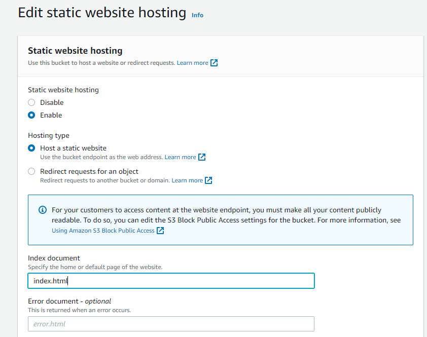

# S3

Create bucket
-------------------------

1.) Go to Amazon S3 service

2.) Create bucket

3.) Choose uniqe bucket name

4.) AWS Region = `eu-central-1`

5.) Grant public access to bucket and objects
	

	
6.) Other options remain default

7.) Create bucket
	
	
Edit bucket policy
-------------------------

1.) Open bucket in buckets view and go to permissions

2.) Edit bucket policy

3.) Copy this bucket policy (replace **&#60;bucketname&#62;** with real bucket name)

		{
			"Version": "2012-10-17",
			"Statement": [
				{
					"Sid": "PublicReadGetObject",
					"Effect": "Allow",
					"Principal": "*",
					"Action": "s3:GetObject",
					"Resource": "arn:aws:s3:::<bucketname>/*"
				}
			]
		}
		
 
		
Static website hosting
-------------------------

1.) Open bucket in buckets view and go to properties

2.) Go to section static website hosting -> edit

3.) Enable static website hosting

4.) Specify index document: index.html
			
 
			
 
5.) Save changes

6.) Go to section static website hosting and copy website endpoint

7.) Paste it to **client.origin** in application.properties
